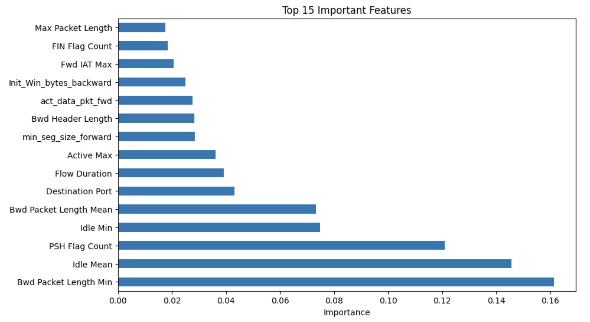

# NetGuard: AI-Enhanced Network Intrusion Detection

**Live Application:** [netguard-seven.vercel.app](https://netguard-seven.vercel.app)  
**API Documentation:** [https://netguard-backend-cnz0.onrender.com/docs](https://netguard-backend-cnz0.onrender.com/docs)

---

## **Project Overview**
NetGuard is an integrated Security Information and Event Management (SIEM) solution that identifies and interprets network threats of high velocity using machine learning and generative AI. The solution enables real-time monitoring and classification of network threats, focusing on various types of DDoS attacks and unauthorized network traffic. The project functions as a complete stack proof of concept for modern Security Operations Center (SOC) automation, which minimizes the cognitive workload of security professionals to interpret raw network metrics into actionable mitigation strategies.

---

## **Visual Proofs**
### **System Demonstration**

### **Dashboard Preview**

---

## **Engineering Architecture**
The system is built in an organized and sacalable manner with components like machine learning model, backend and frontend infrastructures:

### **1. Intelligence Layer**
A complex classification engine driven by XGBoost (Extreme Gradient Boosting) forms the basis of NetGuard's detection capability. Because it can handle the non-linear, high-dimensional nature of network telemetry while retaining the low-latency inference necessary for real-time security monitoring, this model was especially chosen.

#### **A. Model training and dataset**
A very widely used dataset **"CICIDS2017"** was used for the machine learning. Over 2.5 million network flow samples, split between a training set of 1.89 million rows and a testing set of 630,188 rows, comprised the high-volume dataset used to train the engine. 52 unique bi-directional network features, including packet lengths, inter-arrival times, and TCP flag counts, are used to define each sample.

Macro Average Recall was given priority during the training process to make sure the model remained resilient against real-world imbalances, where malicious traffic is frequently dwarfed by legitimate flows. This made it possible to detect low-frequency, covert threats like botnets with the same accuracy as large-scale, volumetric attacks like DDoS.

#### **B. Performance Metrics**
* **Training set size:** (1890563, 52)
* **Testing set size:** (630188, 52)

| Class | Precision | Recall | F1-Score | Support |
| :--- | :--- | :--- | :--- | :--- |
| **Bots** | 0.65 | 0.99 | 0.79 | 487 |
| **Brute Force** | 1.00 | 1.00 | 1.00 | 2287 |
| **DDoS** | 1.00 | 1.00 | 1.00 | 32004 |
| **DoS** | 1.00 | 1.00 | 1.00 | 48436 |
| **Normal Traffic** | 1.00 | 1.00 | 1.00 | 523764 |
| **Port Scanning** | 0.99 | 1.00 | 0.99 | 22674 |
| **Web Attacks** | 0.97 | 1.00 | 0.99 | 536 |
| | | | | |
| **Accuracy** | | | **1.00** | 630188 |
| **Macro Avg** | 0.94 | 1.00 | 0.97 | 630188 |
| **Weighted Avg** | 1.00 | 1.00 | 1.00 | 630188 |

#### **C. Feature importance and behavioral analysis**
The approach does not depend on mere volume spikes but rather uses in-depth behavioral analysis of flow data to detect malicious activity. The training data has pointed to a number of key features that drive the logic of detection:

* **(i) Bwd Packet Length Min:** This is the key feature for Botnet "beaconing" activity. Small and constant values of the backward packet length are typical of automated Command & Control (C2) polling activity.
* **(ii) Idle Mean & Idle Min:** These features enable the model to detect stealthy attacks that have been dormant for certain periods of time to evade traditional firewall detection.
* **(iii) PSH Flag Count:** This feature is crucial for the detection of Web Attacks, where the "Push" flag is employed to immediately trigger the execution of the payload on a target server.

By concentrating on these specific features, the machine learning engine is able to provide a 99% Recall rate for Botnets, thus removing the "False Negative" blind spots that are common in traditional intrusion detection systems.

---

### **2. Backend Architecture**
Backend is built using FastAPI, which was selected for its asynchronous capabilities and native support for high-concurrency tasks.

* **A. Real-Time Communication:** I created a full-duplex connection using WebSockets (/ws/live). This removes the latency of conventional HTTP polling by enabling the server to instantly push threat detections to the user interface as they are processed.
* **B. Persistence Layer:** For historical logging, I incorporated Supabase (PostgreSQL). Long-term forensic analysis is made possible by the backend's management of a relational schema that keeps track of scan metadata and particular threat vectors.
* **C. Processing Logic:** The server manages multimodal ingestion, allowing both direct CSV uploads and raw.pcap files, which are then processed using CICFlowMeter in a temporary extraction environment.

---

### **3. Frontend Architecture**
A React-based command center designed for real-time data visualization makes up the frontend.

* **A. High-Performance Rendering:** I developed a low-latency dashboard that shows network health using Material UI for the interface and Vite for the build process.
* **B. Analytical Dashboards:** I incorporated Recharts to offer graphical depictions of attack intensity and threat vectors, enabling an analyst to rapidly assess the seriousness of an ongoing incident.
* **C. Deployment:** The application makes use of a contemporary CI/CD pipeline, with Render hosting the backend and Vercel hosting the frontend. This environment shows that I am capable of handling environment variables, CORS policies, and secure cross-origin communication in a distributed environment.

---

### **4. Updates and Future Work**
* **A. Hardware Acceleration (FPGA Integration):** Offloading feature extraction logic to FPGA using Verilog for line-rate hardware-level filtering.
* **B. Automated Mitigation (IPS):** Using automated response modules to update local firewall rules or AWS Security Groups is known as automated mitigation (IPS).
* **C. Zero-day Anomaly Detection:** Integrating unsupervised learning layers to identify traffic patterns absent from current datasets is known as "zero-day anomaly detection."

---
### **Note** 
* This project is currently a prototype and for production purposes, it will require some upgrades like better file parsing and live capture logics with lower latency. The project shows the usage of machine learning in detection of network intrusion and warns with mitigation advices to the user or analyst along with clear intrusion trajectories.
* The backend needs some time to wake up as it spins down for inactivity due to free tier restrictions of render. So, the frontend dashboard will require some time to function properly.
* You can test the project using test files in the test csv files folder. These are sample .csv files containing network traffic flows.
  
**Author:** Abhigyan Kulavi  
**Department:** Information Technology  
**Email:** abhigyan.kulavi2004@gmail.com
