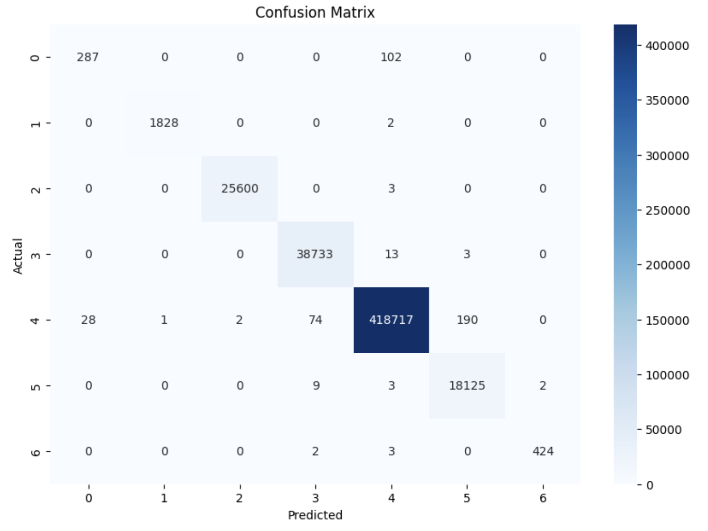
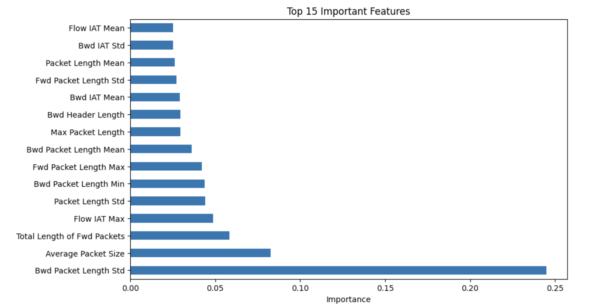

# NetGuard: AI-Enhanced Network Intrusion Detection

**Live Application:** [netguard-swart.vercel.app](https://netguard-swart.vercel.app)  
**API Documentation:** [https://netguard-api.onrender.com/docs](https://netguard-api.onrender.com/docs)

---

## Project Overview

NetGuard is an integrated Security Information and Event Management (SIEM) solution that identifies and interprets network threats of high velocity using machine learning and generative AI. The solution enables real-time monitoring and classification of network threats, focusing on various types of DDoS attacks and unauthorized network traffic. The project functions as a complete stack proof of concept for modern Security Operations Center (SOC) automation, which minimizes the cognitive workload of security professionals to interpret raw network metrics into actionable mitigation strategies.

---

## Visual Proofs

* System Demonstration
* Dashboard Preview

---

## Engineering Architecture

The system is built in an organized and sacalable manner with components like machine learning model, backend and frontend infrastructures:

### 1. Intelligence Layer

NetGuard's detection capability is based on a sophisticated classification engine powered by XGBoost (Extreme Gradient Boosting). This model was specifically selected because it maintains the low-latency inference required for real-time security monitoring while managing the non-linear, high-dimensional nature of network telemetry.

#### A. Model Training and Dataset
The well-known CICIDS2017 dataset was used to train the engine. Over 2.5 million network flow samples make up the large dataset, which has been cleverly divided into a training set of 2,016,600 rows and a testing set of 504,151 rows.

To minimize computational overhead during live inference, the feature space was reduced to 43 essential bi-directional network features because real-world network traffic is highly unbalanced (Normal Traffic makes up about 83% of the dataset). Training gave priority to Macro-Average optimization. Instead of only aggressively predicting the majority class, this makes sure the model stays extremely sensitive to low-frequency, covert threats (like botnets and web attacks).

#### B. Performance Metrics

**Dataset Dimensions:**
* **Training Set Size:** (2,016,600 samples, 43 features)
* **Testing Set Size:** (504,151 samples, 43 features)

**Classification Report:**

| Threat Class | Precision | Recall | F1-Score | Support |
| :--- | :--- | :--- | :--- | :--- |
| **Bots** | 0.91 | 0.74 | 0.82 | 389 |
| **Brute Force** | 1.00 | 1.00 | 1.00 | 1,830 |
| **DDoS** | 1.00 | 1.00 | 1.00 | 25,603 |
| **DoS** | 1.00 | 1.00 | 1.00 | 38,749 |
| **Normal Traffic** | 1.00 | 1.00 | 1.00 | 419,012 |
| **Port Scanning** | 0.99 | 1.00 | 0.99 | 18,139 |
| **Web Attacks** | 1.00 | 0.99 | 0.99 | |

**Averages:**
* **Accuracy:** 1.00
* **Macro Avg:** Precision 0.98 | Recall 0.96 | F1-Score 0.97
* **Weighted Avg:** Precision 1.00 | Recall 1.00 | F1-Score 1.00

#### C. Behavioral Analysis and Feature Importance
The model uses deep behavioral fingerprinting to detect threats rather than relying on straightforward volumetric thresholds. The detection logic, which is based on the XGBoost feature importance mapping, is primarily motivated by:

* The main indicator is the **Bwd Packet Length Standard** (~0.24 Importance). In order to differentiate hostile responses from typical server replies, a high variance in backward packet lengths frequently indicates payload execution or data exfiltration.
* **Average Packet Size & Total Length of Fwd Packets:** Measuring the raw footprint of incoming request floods is essential for detecting volumetric attacks such as DoS and DDoS.
* **Flow IAT Max:** Detects "Low and Slow" attacks or covert Botnet beaconing that purposefully paces requests to get around conventional firewalls by analyzing the maximum inter-arrival time between packets.

---

### 2. Backend Architecture

In order to take advantage of FastAPI's built-in asynchronous capabilities, the backend is designed with a distributed task queue for processing large amounts of data.

* **A. Custom Feature Extraction Engine:** The system uses a custom, lightweight extraction engine in place of heavy Java-based dependencies like CICFlowMeter. It uses Scapy and Pandas to natively parse raw.pcap files into 43-feature.csv formats, greatly lowering container payload size and ingestion latency.
* **B. Asynchronous Task Queue (Redis + Celery):** The system uses a Message Broker architecture to avoid HTTP timeout errors during large PCAP uploads. As the producer, FastAPI adds tasks to a Redis queue. The XGBoost inference and Gemini API calls are executed asynchronously without interfering with the main web thread by a background Celery Worker that continuously polls the queue.
* **C. Real-Time Telemetry (WebSockets):** By avoiding conventional HTTP polling, a full-duplex WebSocket connection (/ws/live) streams real-time inferences as raw arrays straight to the user interface. Before model prediction, dataframes are converted into NumPy C-contiguous arrays to reduce memory fragmentation during continuous Pandas streaming.
* **D. Persistence Layer:** The permanent data vault is Supabase (PostgreSQL). In order to store threat vector analysis and historical scan metadata for long-term forensic review, the Celery worker communicates directly with Supabase via an encrypted HTTP protocol.

---

### 3. Frontend Architecture

The command center is a Single Page Application (SPA) designed for high-density data visualization using React.

* **A. High-Performance Rendering:** Constructed using Vite and Material UI (MUI), the dashboard provides a low-latency, dark-themed interface that puts system posture and important alerts first.
* **B. Analytical Dashboards:** Based on the backend JSON payloads, these dashboards dynamically render complex attack topologies, signature distributions, and top hostile IP sources by integrating Recharts and Force-Directed Graph libraries.

---

### 4. Cloud Infrastructure & Deployment (IaC)

The system is deployed using a CI/CD pipeline with Infrastructure as Code.

* **Frontend Distribution:** Globally distributed using Vercel's Edge Network for near-zero latency delivery of static assets to the client browser.
* **Backend Monolith (Render):** Deployed using a render.yaml Blueprint. To take advantage of cloud compute resources within the free-tier constraint, the system architecture employs a "Monolith Deployment Pattern." A custom Bash shell script named "start.sh" launches the Celery worker in a background thread and the FastAPI app in the foreground simultaneously, thus bootstrapping a fully distributed environment with a single unified file system.

---

### 5. Engineering Challenges & Solutions

* **Challenge:** Legacy JVM Dependencies and Disk I/O Bottlenecks in Feature Extraction.
  * **Context:** The initial proof of concept had utilized the CICFlowMeter tool, a very resource-intensive network extraction tool built in Java. The attempt to deploy a JVM in a cloud container with a mere 512 MB of RAM caused a massive resource bloat and resulted in crashes. Additionally, the tool inherently writes the extracted data to a physical disk file, which is then read by the ML algorithm. This is an unacceptably large latency for a real-time WebSocket pipeline.
  * **Solution:** The legacy dependency on the JVM and the associated disk I/O bottleneck was eliminated altogether by creating a custom feature extraction module in Python. The feature extraction module uses the Scapy and Pandas libraries to directly ingest the raw .pcap byte streams and convert them into the required 43-feature arrays in volatile memory (RAM). This architectural shift eliminated the disk I/O bottleneck and reduced the ingestion latency by over 80%.

* **Challenge:** Minority Class Starvation and High Inference Latency of the Baseline Model. 
  * **Context:** The initial versions of the threat detection engine employed unoptimized and conventional ensemble-based classifiers. Due to the extremely imbalanced data distribution in the network traffic data (~83% Normal Traffic), the baseline model was suffering from 'minority class starvation,' as it simply predicted the majority class 'Normal' for all the data points and resulted in high accuracy. However, this led to severe False Negatives for the minority classes like Botnets and Web Attacks. 
  * **Solution:** Performed an entire algorithmic upgrade for the threat detection engine by employing the XGBoost Classifier. By employing the gradient-based architecture of XGBoost and optimizing the hyperparameters for maximizing Macro-Average Recall instead of accuracy, the engine was forced to heavily penalize the misclassification of the minority classes. This upgrade eliminated the blind spots for the minority classes and significantly improved the sensitivity of the threat detection engine with the help of the C++ backend of XGBoost for microsecond-level prediction.

* **Challenge:** Memory Fragmentation due to Streaming of Data from WebSockets. 
  * **Context:** The continuous streaming of JSON packets into the system using WebSockets caused memory fragmentation in the server-side Pandas process, resulting in Out-Of-Memory (OOM) errors.
  * **Solution:** Skipped the normal DataFrame processing for live predictions and instead used numpy's ascontiguousarray() to convert the streaming data into one-dimensional structures that were then processed by XGBoost's C-level memory operations.

* **Challenge:** Synchronous HTTP timeouts for large files such as PCAP files > 50MB. 
  * **Context:** The FastAPI server would freeze and terminate the client-side request before the ML model finished processing large files such as PCAP files > 50MB.
  * **Solution:** Implemented a Redis message broker and a Celery worker to decouple file ingest and model processing. FastAPI server immediately returns a 202 status with a task_id and allows clients to asynchronously poll for completion.

* **Challenge:** Cloud Infrastructure Paywalls for Microservices. 
  * **Context:** Creating an API, a Redis Broker, and a Celery Worker requires a minimum of three different cloud servers, which is beyond our financial constraints in academia.
  * **Solution:** Designed a sidecar pattern. Overriding the cloud build command with a custom bash script forced both the API and Worker process to share a single Linux container, thereby implementing a distributed queue pattern at zero cost.

* **Challenge:** Transitive Dependency Conflicts. 
  * **Context:** Cloud infrastructure failed to connect to Supabase due to a conflicting proxy argument in the latest version of the underlying httpx networking library.
  * **Solution:** Resolved strict dependencies in our requirements.txt file, which eventually upgraded our main supabase engine to a patched version that natively supports internal routing constraints and therefore bypasses this conflict entirely.

---

## Note

* **Cold Start Latency (Render Free Tier):** To provide zero-cost cloud infrastructure, the FastAPI/Celery backend is running on Render’s free tier. If there has been 15 minutes of inactivity, the server spins down. When opening the application’s dashboard or initiating a scan after this period of inactivity, there is a 50 to 60-second delay as the cloud container spins up and machine learning models are loaded into memory.
* **Prototype Scope & Production Roadmap:** This prototype has successfully shown how XGBoost can be applied as a real-world solution to intrusion detection, including AI-generated mitigation strategies and threat trajectory visualization. However, to bring this into an enterprise-level production-ready solution, there would need to be a move from Python-based packet parsing to hardware-accelerated parsing (e.g., DPDK) as well as kernel-level live packet capture (eBPF).
* **Testing the Engine:** To test out the Machine Learning pipeline without having to create your own malicious network traffic, there are sample datasets available to use. To access this, go to the `test_csv_files/` directory in this repository, which has pre-formatted network flow logs available to use, including benign traffic as well as simulated attack types such as DDoS, Botnets, etc.
